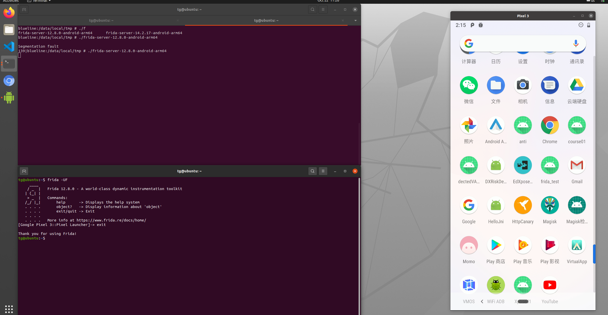
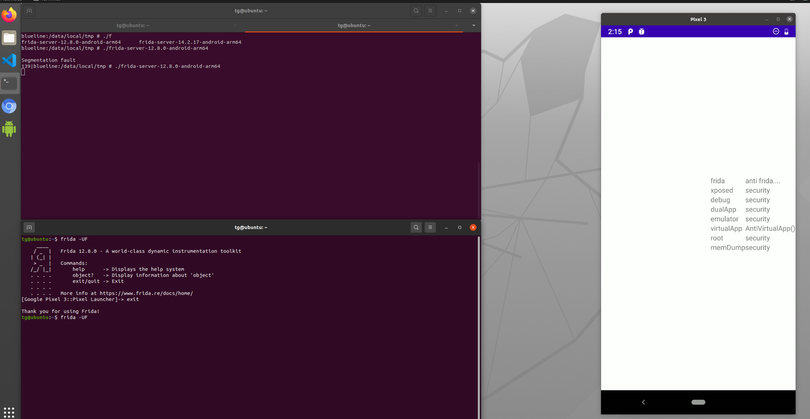
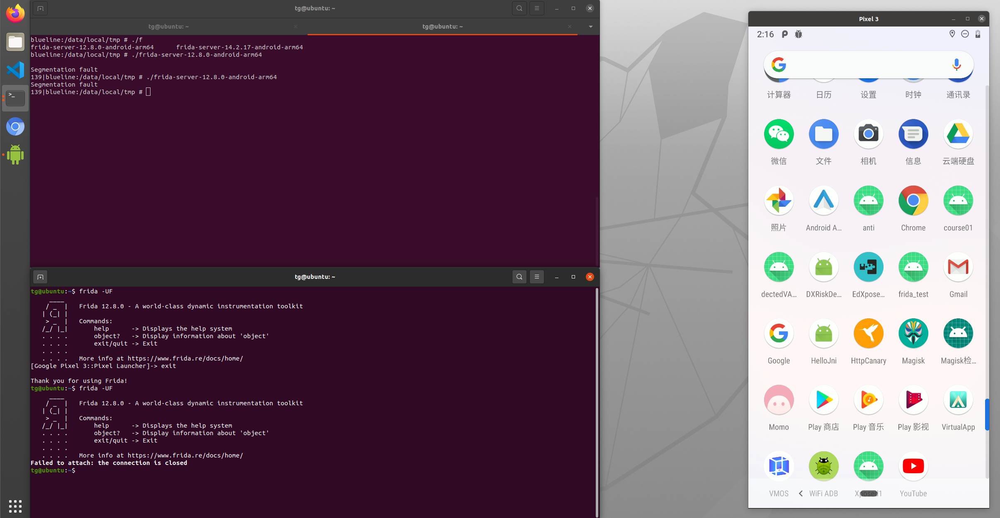
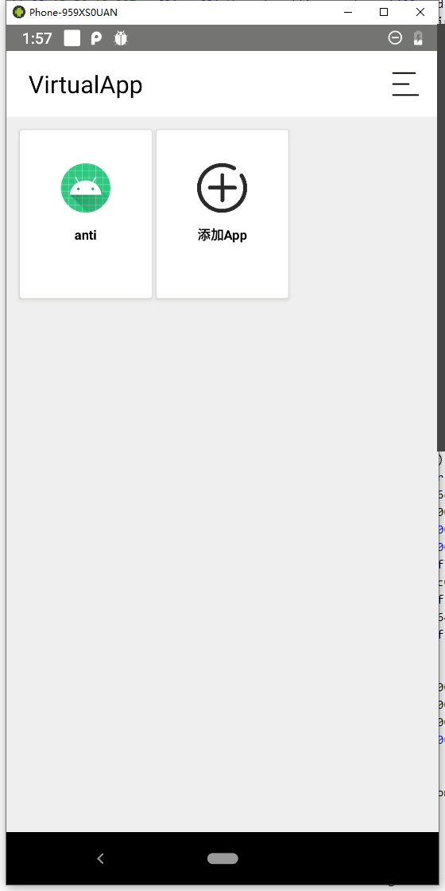
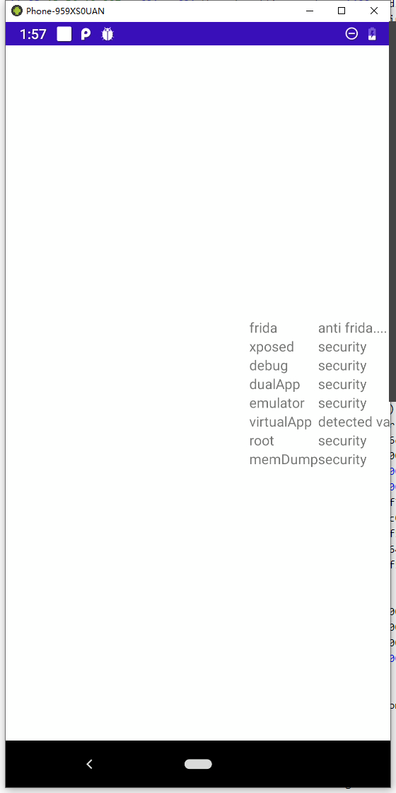

# anti

## Introduction

Is a protect Android App anti any attacks and environments.

可能会通过检测的方式来进行anti，也有可能通过攻击手段的实现原理进行anti。

## Anti Frida

根据frida的实现细节来作出相应的anti对策。
frida在hook的时候会对目标应用的libc进行获取，使用目标libc的mmap将自身的相关so注册到目标maps表中;再执行目标libc的dlopen和dlsym函数将自身so中的函数进行执行，从而实现了hook操作，详情请看：
https://github.com/frida/frida-core/blob/8f6e88225b702d062ab581c905448b88384f6ab6/src/linux/frida-helper-backend-glue.c
anti frida的灵感也是来自于这里。就是将mmap一个只读的libc到maps表中，这样frida 无法将继续拿到可执行的libc从而崩溃。能够有效针对https://github.com/hluwa/strongR-frida-android 此类项目的去掉特征。

`Anti Frida`只对frida attach模式攻击的对抗。

## Anti Xposed/like Xposed

## Anti Root

## Anti Debug

## Anti MemDump
思路来源：https://github.com/darvincisec/AntiDebugandMemoryDump
- 使用监视相关文件

更多详细内容，参考：https://s5rxx58djb.feishu.cn/docs/doccnEenEJJas6iQPjc83M0dLed

## Anti Virtual App/Multi Run

### Anti Virtual App
Virtual App 会在自己的文件系统中创建一个文件目录，通过这特点可以判断是否为Virtual App，因为正常情况下，app访问所有父目录都是不可读的。
思路来自：https://juejin.cn/post/6964673582924300296#heading-18

### Anti Multi Run
思路来源：https://bbs.pediy.com/thread-255212.htm
基于svc来获得app的安装目录，防止被hook（除内核层面）。

## Anti Emulator
